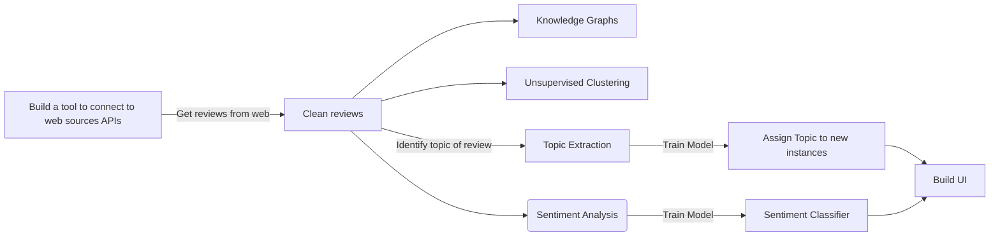

# Topic Modelling with NLP & Latent Dirichlet Allocation on Customer Reviews
 

Purpose of this project is to leverage reviews about major delivery companies that are operating in the UK, and perform NLP tasks to analyze different aspects of the reviews like the sentiment, most common words, probability distributions across word sequences, and more.

## Introduction

In this project we are going to explore the world of logistic companies and the issues that they might be facing. Specifically, we are going to focus on analyzing data regarding a few of the most well-known delivery companies in the UK, namely <a href="https://en.wikipedia.org/wiki/Deliveroo" style="text-decoration:none"> Deliveroo</a>, <a href="https://en.wikipedia.org/wiki/UberEats" style="text-decoration:none"> UberEats</a>, <a href="https://en.wikipedia.org/wiki/Just_Eat" style="text-decoration:none"> Just Eat</a> and <a href="https://stuart.com/" style="text-decoration:none"> Stuart</a>. To do that, we are going to utilize the internet and the reviews that someone can many different platforms - especially these platforms that are specializing at collecting reviews and opininions of customers for a plethora of companies and services. 

The first iteration of this project it's using the reviews that can be found in the famous consumer review website <a href="https://en.wikipedia.org/wiki/Trustpilot" style="text-decoration:none"> TrustPilot</a>. Even though the website is already providing some API functionalities, we are going to write our own web-scraping tool to retrieve the data in the format that we want. We will attempt to collect as many reviews as possible and then use them to identify interesting findings in the text. For example, we will try to identify what is the sentiment across all reviews for a specific company, what are the most common words and bigrams (i.e. pairs of words that tend to appear next to each other) in the reviews, and more. Finally, we will implement a <a href="https://en.wikipedia.org/wiki/Latent_Dirichlet_allocation" style="text-decoration:none"> Latent Dirichlet Allocation</a> model to try and identify what are the topics that these reviews correspond to. Note that they LDA model is going to be implemented twice, one for the negative and one for the positive reviews.

## Project Roadmap

### Version 1.0: (Most recent version of the Notebook can be found here: <a href="https://github.com/gpsyrou/Text_Analysis_of_Consumer_Reviews/blob/main/jupyter_notebook/reviews.ipynb">V1.0 Notebook</a>)

- [x] Impementation of the v1.0 of web scraper and data collection API 
- [x] Developed a standard LDA model for topic identification
- [x] Created first version of visualizations to present the results

## Web-Scrapping Tool and Data Retrieval

In order to collect the reviews directly from the TrustPilot website, we have created a web-scrapping tool that allowed us to automate this process across different companies & their corresponding reviews. This tool is iterating across different pages of the website and collects the reviews and any other relevant information, with the output being stored in CSV files. Moreover, we have packaged the tool into a python library. Hence, if you are thinking of working on a similar project where you need to retrieve data from TrustPilot, you can install the package that you can find <a href="https://github.com/gpsyrou/Text_Analysis_of_Consumer_Reviews/blob/main/trustplt.py" style="text-decoration:none">here</a>. As of January 2023, the package contains the main functionalities to collect many different information from the website, like the reviews, reviewer_id, date of the review, user rating, and more. 

For the first iteration of the project, we have built the aforementioned package with the functionality to retrieve the following information - which will also be the features in our dataset:

1. **Company**: Name of the Company that we are examining (e.g. Deliveroo, UberEats, JustEat, Stuart)
2. **Id**: The unique identifier for the review
3. **Reviewer_Id**: Unique id for a reviewer/user
4. **Title**: Title of the review
5. **Review**: The text corresponding to the review submitted from the reviewer
6. **Date**: Day of review submission
7. **Rating**: The rating about the company, as submitted from the reviewer

### Input Schema

| Column/Feature                                  | Type | Description |
|-------------------------------------------------|---| ---|
| Company                                         | NVARCHAR | Name of the delivery company |
| Id                                              | NVARCHAR | Id of the review |
| Reviewer_Id                                     | NVARCHAR | Id of the reviewer    |
| Title                                           | NVARCHAR | Title of the review    |
| Review                                          | NVARCHAR | The review itself - free text field    |
| Date                                            | DATE     | Day that the review was submitted    |
| Rating                                          | BIGINT   | Rating (1-5)|

## Data Retrieval API

To get reviews from the TrustPilot website, we are leveraging a custom made web scraping tool. This tool is iterating across different pages of the website and collects the reviews and any other relevant information, with the output being stored in CSV files.

### Running Guide

1. Set-up the appropriate configurations in config.json (<a href="https://raw.githubusercontent.com/gpsyrou/Text_Analysis_of_Consumer_Reviews/main/config.json">example</a>). The config needs to get populated with the following metadata: 
        - <em>source_url</em>: Main domain URL 
        - <em>starting_page</em>: Domain subpath to a specific reviews page 
        - <em>steps</em>: Defines number of pages to iterate over 
        - <em>company</em>: Company/Service of interest 

2. Execute the python retriever script 
        `python data_retriever.py`
