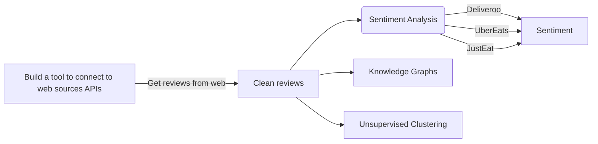

Purpose of this project is to leverage reviews about major delivery companies that are operating in the UK, and perform NLP tasks to analyze different aspects of the reviews like the sentiment, most common words, probability distributions across word sequences, and more.

Project Roadmap

[](https://mermaid-js.github.io/mermaid-live-editor/#/edit/eyJjb2RlIjoiZ3JhcGggICBMUlxuICAgIEFbQnVpbGQgYSB0b29sIHRvIGNvbm5lY3QgdG8gd2ViIHNvdXJjZXMgQVBJc10gLS0-fEdldCByZXZpZXdzIGZyb20gd2VifCBCW0NsZWFuIHJldmlld3NdXG4gICAgQiAtLT4gQyhTZW50aW1lbnQgQW5hbHlzaXMpXG4gICAgQyAtLT58RGVsaXZlcm9vfCBEW1NlbnRpbWVudF1cbiAgICBDIC0tPnxVYmVyRWF0c3wgRFtTZW50aW1lbnRdXG4gICAgQyAtLT58SnVzdEVhdHwgRFtTZW50aW1lbnRdXG4gICAgQiAtLT4gRVtLbm93bGVkZ2UgR3JhcGhzXVxuICAgIEIgLS0-IEZbVW5zdXBlcnZpc2VkIENsdXN0ZXJpbmddXG4iLCJtZXJtYWlkIjp7fSwidXBkYXRlRWRpdG9yIjpmYWxzZX0)