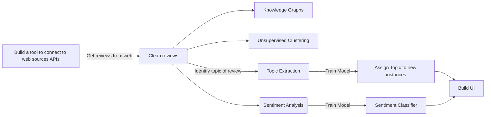

# Topic Modelling with NLP & Latent Dirichlet Allocation on Customer Reviews
 

Purpose of this project is to leverage reviews about major delivery companies that are operating in the UK, and perform NLP tasks to analyze different aspects of the reviews like the sentiment, most common words, probability distributions across word sequences, and more.

## Project Roadmap

## Data Retrieval API

To get reviews from the TrustPilot website, we are leveraging a custom made web scraping tool. This tool is iterating across different pages of the website and collects the reviews and any other relevant information, with the output being stored in CSV files.

### Running Guide

1. Set-up the appropriate configurations in config.json. The config needs to get populated with the following metadata: 
        - <em>source_url</em>: Main domain URL 
        - <em>starting_page</em>: Domain subpath to a specific reviews page 
        - <em>steps</em>: Defines number of pages to iterate over 
        - <em>company</em>: Company/Service of interest 

2. Execute the python retriever script 
        `python data_retriever.py`
